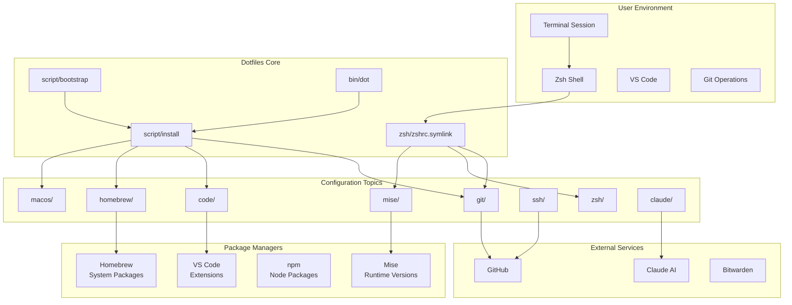
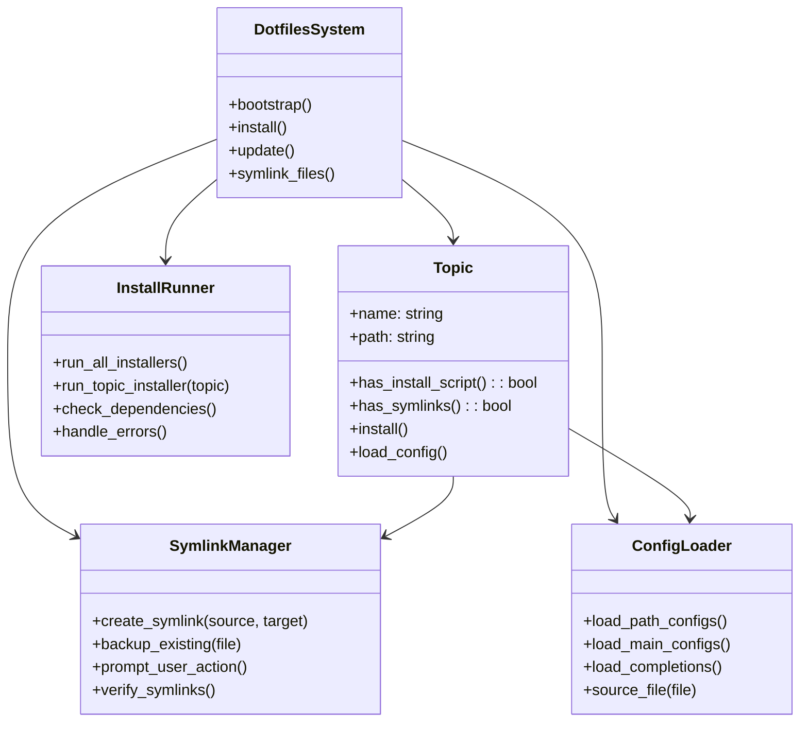
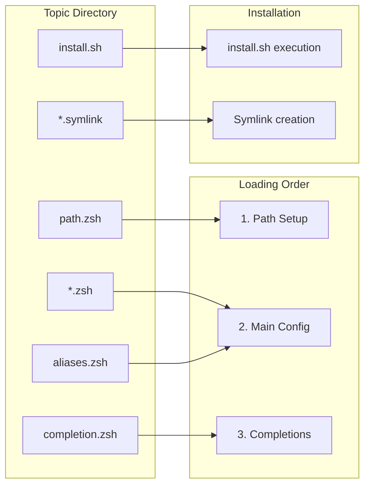
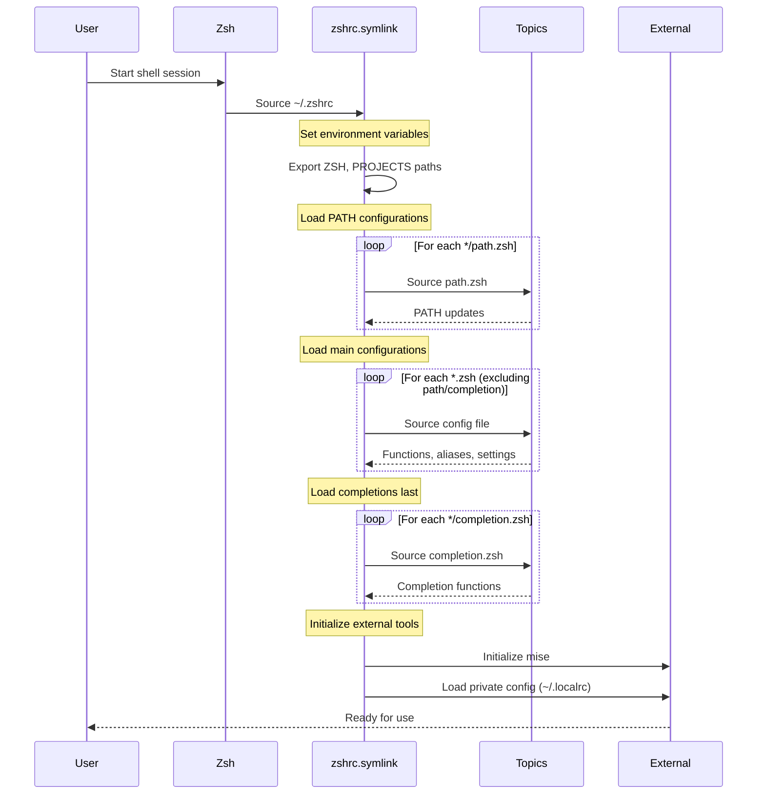
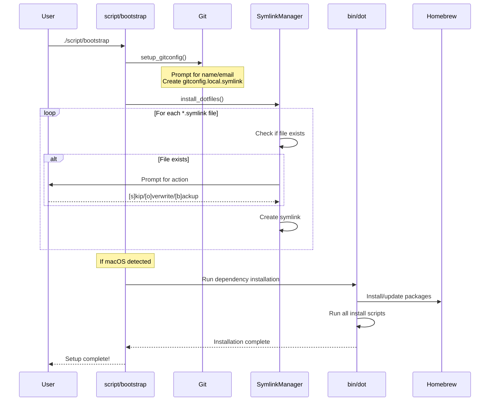
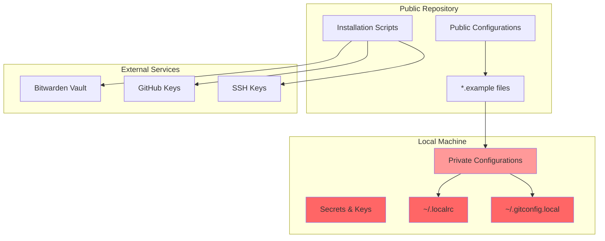

# 🏗 Architecture Overview

This document provides a comprehensive overview of the dotfiles architecture, including system design, component interactions, and data flow patterns.

## Table of Contents

- [System Architecture](#system-architecture)
- [Component Diagram](#component-diagram)
- [Loading Sequence](#loading-sequence)
- [File Organization](#file-organization)
- [Extension Points](#extension-points)
- [Security Model](#security-model)
- [Performance Considerations](#performance-considerations)

## System Architecture



## Component Diagram

### Core Components



### Topic Structure



## Loading Sequence

### Shell Initialization Flow



### Bootstrap Installation Flow



## File Organization

### Directory Structure

```
~/.dotfiles/
├── 📁 Core System Files
│   ├── script/
│   │   ├── bootstrap          # First-time setup
│   │   └── install           # Run all installers
│   ├── bin/
│   │   ├── dot               # Update system
│   │   └── git-*             # Git utilities
│   ├── Brewfile              # Homebrew packages
│   └── README.md
│
├── 📁 Configuration Topics
│   ├── git/
│   │   ├── gitconfig.symlink     # → ~/.gitconfig
│   │   ├── gitconfig.local.symlink.example
│   │   ├── aliases.zsh           # Git aliases
│   │   └── completion.zsh        # Git completions
│   │
│   ├── zsh/
│   │   ├── zshrc.symlink         # → ~/.zshrc (main loader)
│   │   ├── config.zsh            # Zsh configuration
│   │   ├── prompt.zsh            # Custom prompt
│   │   ├── completion.zsh        # General completions
│   │   ├── fpath.zsh            # Function path setup
│   │   └── window.zsh           # Terminal title
│   │
│   ├── code/
│   │   ├── settings.json         # → ~/.../Code/User/
│   │   ├── keybindings.json      # → ~/.../Code/User/
│   │   ├── install.sh            # Extension installer
│   │   └── path.zsh             # Add code to PATH
│   │
│   ├── mise/
│   │   ├── mise.toml.symlink     # → ~/.mise.toml
│   │   ├── mise.zsh             # Mise initialization
│   │   ├── install.sh           # Runtime installation
│   │   └── completion.zsh       # Mise completions
│   │
│   └── [other topics]/
│
├── 📁 Extended Features
│   ├── claude/
│   │   ├── agents/              # AI agent definitions
│   │   ├── commands/            # Custom commands
│   │   ├── install.sh           # Claude setup
│   │   └── aliases.zsh          # Claude shortcuts
│   │
│   └── functions/
│       ├── c                    # Directory jumping
│       ├── extract              # Archive extraction
│       └── _*                   # Completion functions
```

### File Types and Their Purposes

| Pattern | Purpose | Example | Destination | Loading Order |
|---------|---------|---------|-------------|---------------|
| `*.symlink` | Files to link to home directory | `gitconfig.symlink` | `~/.gitconfig` | During bootstrap |
| `path.zsh` | PATH modifications | Add `/usr/local/bin` | Shell PATH | 1st (earliest) |
| `env.zsh` | Environment variables | `export VAR="value"` | Shell environment | 2nd |
| `aliases.zsh` | Command aliases | `alias ll='ls -la'` | Shell aliases | 2nd |
| `*.zsh` | Other shell configuration | Functions, settings | Shell environment | 2nd |
| `completion.zsh` | Shell completions | Command completions | Zsh completion system | 3rd (last) |
| `install.sh` | Installation scripts | Install packages | System setup | During install |

### Naming Consistency Requirements

**Strict Naming Convention** (must be exact):
- `install.sh` - Installation script for the topic
- `path.zsh` - PATH modifications (loaded first)
- `aliases.zsh` - Command aliases
- `env.zsh` - Environment variables
- `completion.zsh` - Shell completions (loaded last)
- `*.symlink` - Files to be symlinked to home directory

**Ignored Patterns**:
- Folders starting with `_` (e.g., `_docs/`, `_archive/`, `_private/`)
- Files starting with `_` in any folder
- `.git` directory and all its contents

**Special Cases** (non-standard handling):
- `ssh/config` - Symlinked to `~/.ssh/config` by install.sh (special location)
- `ghostty/config` - Symlinked to Ghostty's app support by install.sh
- `code/settings.json` & `code/keybindings.json` - Copied to VS Code config location
- `macos/set-defaults.sh` & `macos/set-hostname.sh` - Must keep exact names, called by `macos/install.sh`
  - The wrapper prevents duplicate execution (previously called directly by `bin/dot`)
- `git/gitconfig.local.symlink` - Generated by bootstrap, not stored in repo

## Extension Points

### Adding New Topics

1. **Create Topic Directory**
   ```bash
   mkdir ~/.dotfiles/newtopic
   ```

2. **Add Configuration Files**
   ```bash
   # Shell configuration
   echo "# New topic config" > newtopic/config.zsh
   
   # PATH additions
   echo 'export PATH="$PATH:/new/path"' > newtopic/path.zsh
   
   # Aliases
   echo 'alias nt="newtopic-command"' > newtopic/aliases.zsh
   ```

3. **Create Installation Script**
   ```bash
   cat > newtopic/install.sh << 'EOF'
   #!/bin/sh
   echo "Installing newtopic..."
   
   if [ "$(uname -s)" = "Darwin" ]; then
     brew install newtopic-package
   fi
   EOF
   chmod +x newtopic/install.sh
   ```

4. **Add Symlink Files**
   ```bash
   # Configuration that goes to home directory
   echo "config content" > newtopic/config.symlink  # → ~/.config
   ```

### Hooks and Integration Points

```bash
# ~/.localrc - Private configuration (gitignored)
export PRIVATE_API_KEY="secret"
source ~/.custom-config

# ~/.gitconfig.local - Private git config (gitignored) 
[user]
    name = Your Name
    email = your@email.com

# ~/.dotfiles/ssh/config_local - Private SSH config
Host private-server
    HostName 192.168.1.100
    User admin
```

### Custom Functions and Utilities

```bash
# Add to any topic's *.zsh file
function my_custom_function() {
    echo "Custom functionality"
}

# Or create dedicated function file
# ~/.dotfiles/functions/my_function
function my_function() {
    # Implementation
}
```

## Security Model

### Sensitive Data Handling



### File Permissions

```bash
# SSH configuration
chmod 700 ~/.ssh
chmod 600 ~/.ssh/config
chmod 600 ~/.ssh/id_*
chmod 644 ~/.ssh/id_*.pub

# Private configuration files
chmod 600 ~/.localrc
chmod 600 ~/.gitconfig.local

# Installation scripts
chmod +x ~/.dotfiles/*/install.sh
chmod +x ~/.dotfiles/script/*
chmod +x ~/.dotfiles/bin/*
```

## Performance Considerations

### Shell Startup Optimization

1. **Lazy Loading**: Heavy tools initialized only when needed
   ```bash
   # Instead of: eval "$(mise activate zsh)"
   # Use conditional loading:
   if (( $+commands[mise] )); then
     eval "$(mise activate zsh)"
   fi
   ```

2. **Completion Loading**: Completions loaded last to avoid blocking
   ```bash
   # In zshrc.symlink
   # 1. Load paths first (fast)
   # 2. Load configs (medium)  
   # 3. Load completions last (slow)
   ```

3. **Function Definition**: Define functions instead of running commands
   ```bash
   # Good: Define function for later use
   function docker_cleanup() {
     docker system prune -f
   }
   
   # Avoid: Running expensive commands at shell start
   # docker system prune -f  # Don't do this
   ```

### Installation Performance

1. **Parallel Installation**: Where possible, run installers in parallel
2. **Idempotent Scripts**: Scripts can be run multiple times safely
3. **Dependency Checking**: Skip installation if already present
4. **Progress Feedback**: Provide user feedback for long operations

### Memory Usage

```bash
# Monitor shell memory usage
ps -o pid,ppid,rss,vsz,comm -p $$

# Profile zsh startup time  
time zsh -i -c exit

# Identify slow loading components
zsh -x -i -c exit 2>&1 | grep -E '^\+'
```

---

This architecture provides a solid foundation for maintaining a scalable, secure, and performant development environment configuration system.