# ⚙️ Configuration Reference

This document provides detailed information about all configuration files, their purposes, and how to customize them for your needs.

## Table of Contents

- [Configuration Overview](#configuration-overview)
- [Core Configuration Files](#core-configuration-files)
- [Topic-Specific Configurations](#topic-specific-configurations)
- [Environment Variables](#environment-variables)
- [Private Configuration](#private-configuration)
- [Package Management](#package-management)
- [Customization Guide](#customization-guide)

## Configuration Overview

The dotfiles system uses a layered configuration approach:

```mermaid
graph TD
    subgraph "Configuration Layers"
        SystemDefaults[System Defaults]
        DotfilesConfig[Dotfiles Configuration]
        PrivateConfig[Private Configuration]
        RuntimeConfig[Runtime Configuration]
    end
    
    subgraph "File Types"
        Symlinks[*.symlink → ~/.*]
        ZshConfigs[*.zsh → Shell]
        InstallConfigs[install.sh → System]
        JSONConfigs[JSON/TOML → Applications]
    end
    
    SystemDefaults --> DotfilesConfig
    DotfilesConfig --> PrivateConfig
    PrivateConfig --> RuntimeConfig
    
    DotfilesConfig --> Symlinks
    DotfilesConfig --> ZshConfigs
    DotfilesConfig --> InstallConfigs
    DotfilesConfig --> JSONConfigs
```



### Configuration Hierarchy

1. **System Defaults** - macOS/OS defaults
2. **Dotfiles Configuration** - Public, version-controlled settings
3. **Private Configuration** - Local, gitignored overrides
4. **Runtime Configuration** - Dynamic, session-specific settings

## Core Configuration Files

### 📁 Root Level Files

#### `Brewfile`
**Purpose**: Declarative package management for Homebrew

```ruby
# Taps (additional repositories)
tap "homebrew/cask"
tap "homebrew/services"
tap "hashicorp/tap"

# CLI Tools
brew "git"
brew "node"
brew "python"
brew "go"
brew "rust"
brew "docker"
brew "kubernetes-cli"
brew "terraform"
brew "jq"
brew "yq"
brew "curl"
brew "wget"

# GUI Applications
cask "visual-studio-code"
cask "docker"
cask "arc"
cask "tableplus"
cask "notion"
cask "spotify"

# Mac App Store Applications
mas "Xcode", id: 497799835
```

**Customization**:
```bash
# Add new packages
echo 'brew "new-tool"' >> Brewfile
brew bundle

# Add new casks
echo 'cask "new-app"' >> Brewfile
brew bundle
```

---

### 🐚 Shell Configuration (`zsh/`)

#### `zshrc.symlink` → `~/.zshrc`
**Purpose**: Main shell configuration loader

```bash
#!/usr/bin/env zsh
# Main zsh configuration file

# Set environment
export ZSH=$HOME/.dotfiles
export PROJECTS=$HOME/Code

# Load path configurations first
for file in $ZSH/*/path.zsh; do
  [ -r "$file" ] && source "$file"
done

# Load main configurations  
for file in $ZSH/*/*.zsh; do
  case "$file" in
    */path.zsh|*/completion.zsh) continue ;;
    *) [ -r "$file" ] && source "$file" ;;
  esac
done

# Load completions last
for file in $ZSH/*/completion.zsh; do
  [ -r "$file" ] && source "$file"
done

# Load private configuration
[ -r ~/.localrc ] && source ~/.localrc
```

#### `config.zsh`
**Purpose**: Core Zsh configuration and options

```bash
# History configuration
export HISTFILE=~/.zsh_history
export HISTSIZE=50000
export SAVEHIST=10000

# Zsh options
setopt NO_BG_NICE                # Don't nice background tasks
setopt NO_HUP                    # Don't send SIGHUP to background jobs
setopt NO_LIST_BEEP              # Don't beep on ambiguous completions
setopt LOCAL_OPTIONS             # Allow functions to have local options
setopt LOCAL_TRAPS               # Allow functions to have local traps
setopt HIST_VERIFY               # Show expanded history before executing
setopt SHARE_HISTORY             # Share history between sessions
setopt EXTENDED_HISTORY          # Add timestamps to history
setopt PROMPT_SUBST              # Allow substitution in prompts
setopt CORRECT                   # Try to correct spelling
setopt COMPLETE_IN_WORD          # Allow completion in middle of word
setopt IGNORE_EOF                # Don't exit on EOF (Ctrl-D)
setopt APPEND_HISTORY            # Add to history file incrementally
setopt INC_APPEND_HISTORY        # Add commands as they're typed
setopt HIST_IGNORE_ALL_DUPS      # Don't record duplicates
setopt HIST_REDUCE_BLANKS        # Remove extra blanks from history
```

#### `prompt.zsh`
**Purpose**: Custom shell prompt configuration

```bash
# Git branch display
git_branch() {
  ref=$(git symbolic-ref HEAD 2> /dev/null) || return
  echo "${ref#refs/heads/}"
}

# Git status indicators
git_dirty() {
  if [[ -n $(git status --porcelain 2> /dev/null) ]]; then
    echo "%{$fg[red]%}✗%{$reset_color%}"
  else
    echo "%{$fg[green]%}✓%{$reset_color%}"
  fi
}

# Main prompt
PROMPT='
%{$fg[cyan]%}%c%{$reset_color%} $(git_branch) $(git_dirty)
→ '

# Right-side prompt
RPROMPT='%{$fg[white]%}%T%{$reset_color%}'
```

---

### 📝 Git Configuration (`git/`)

#### `gitconfig.symlink` → `~/.gitconfig`
**Purpose**: Public git configuration

```ini
[user]
    # User details loaded from gitconfig.local.symlink
[include]
    path = ~/.gitconfig.local
    
[core]
    excludesfile = ~/.gitignore_global
    editor = code --wait
    autocrlf = input
    
[color]
    ui = auto
    
[color "branch"]
    current = yellow reverse
    local = yellow
    remote = green
    
[color "diff"]
    meta = yellow bold
    frag = magenta bold
    old = red bold
    new = green bold
    
[push]
    default = simple
    followTags = true
    
[pull]
    rebase = true
    
[branch]
    autosetupmerge = always
    autosetuprebase = always
    
[diff]
    renames = copies
    
[alias]
    # Shortcuts
    co = checkout
    br = branch
    ci = commit
    st = status
    
    # Useful aliases
    unstage = reset HEAD --
    last = log -1 HEAD
    visual = !gitk
    
[merge]
    tool = vscode
    
[mergetool "vscode"]
    cmd = code --wait $MERGED
    
[diff]
    tool = vscode
    
[difftool "vscode"]
    cmd = code --wait --diff $LOCAL $REMOTE
```

#### `gitconfig.local.symlink.example`
**Purpose**: Template for private git configuration

```ini
# Copy to gitconfig.local.symlink and customize
[user]
    name = Your Name
    email = your.email@example.com
    
[credential]
    helper = osxkeychain
    
# Optional: Signing commits
[commit]
    gpgsign = true
[gpg]
    program = gpg
```

---

### 💻 VS Code Configuration (`code/`)

#### `settings.json`
**Purpose**: VS Code editor settings

```json
{
  "editor.fontFamily": "'JetBrains Mono', 'Fira Code', Menlo, monospace",
  "editor.fontSize": 14,
  "editor.lineHeight": 1.5,
  "editor.fontLigatures": true,
  "editor.tabSize": 2,
  "editor.insertSpaces": true,
  "editor.wordWrap": "on",
  "editor.rulers": [80, 120],
  "editor.minimap.enabled": false,
  "editor.renderWhitespace": "boundary",
  "editor.formatOnSave": true,
  "editor.codeActionsOnSave": {
    "source.fixAll.eslint": true,
    "source.organizeImports": true
  },
  
  "workbench.colorTheme": "Monokai Pro",
  "workbench.iconTheme": "Monokai Pro Icons",
  "workbench.tree.indent": 15,
  "workbench.editor.enablePreview": false,
  
  "terminal.integrated.fontSize": 14,
  "terminal.integrated.fontFamily": "'JetBrains Mono', Menlo, monospace",
  
  "files.autoSave": "afterDelay",
  "files.autoSaveDelay": 1000,
  "files.trimTrailingWhitespace": true,
  "files.insertFinalNewline": true,
  
  "git.autofetch": true,
  "git.confirmSync": false,
  "git.enableSmartCommit": true,
  
  "extensions.autoUpdate": true,
  
  "typescript.preferences.importModuleSpecifier": "relative",
  "javascript.preferences.importModuleSpecifier": "relative",
  
  "[javascript]": {
    "editor.defaultFormatter": "esbenp.prettier-vscode"
  },
  "[typescript]": {
    "editor.defaultFormatter": "esbenp.prettier-vscode"
  },
  "[json]": {
    "editor.defaultFormatter": "esbenp.prettier-vscode"
  }
}
```

#### `keybindings.json`
**Purpose**: Custom keyboard shortcuts

```json
[
  {
    "key": "cmd+shift+r",
    "command": "workbench.action.reloadWindow"
  },
  {
    "key": "cmd+k cmd+s",
    "command": "workbench.action.files.saveFiles"
  },
  {
    "key": "cmd+shift+d",
    "command": "editor.action.duplicateSelection"
  },
  {
    "key": "alt+up",
    "command": "editor.action.moveLinesUpAction"
  },
  {
    "key": "alt+down",
    "command": "editor.action.moveLinesDownAction"
  }
]
```

---

### 🛠️ Development Tools

#### `mise.toml.symlink` → `~/.mise.toml`
**Purpose**: Runtime version management

```toml
[tools]
# Node.js - Latest LTS
node = "lts"

# Python - Multiple versions for compatibility
python = ["3.11", "3.12"]

# Go - Latest stable
go = "latest"

# Rust - Latest stable
rust = "latest"

# Terraform - Multiple versions for different projects  
terraform = ["1.6", "1.7"]

# Elixir/Erlang - Latest versions
elixir = "latest"
erlang = "latest"

# Ruby - Latest stable
ruby = "latest"

# Java - LTS versions
java = ["11", "17", "21"]

[env]
# Custom environment variables
GOPATH = "{{config_dir}}/go"
CARGO_HOME = "{{config_dir}}/cargo"

[tasks.tf]
description = "Terraform operations"
run = "terraform $@"

[tasks.k8s]
description = "Kubernetes operations" 
run = "kubectl $@"
```

#### `ssh/config`
**Purpose**: SSH client configuration

```ssh-config
# Default settings
Host *
    UseKeychain yes
    AddKeysToAgent yes
    ServerAliveInterval 60
    ServerAliveCountMax 3
    
# GitHub
Host github.com
    HostName github.com
    User git
    IdentityFile ~/.ssh/id_ed25519
    
# Include private configuration
Include ~/.ssh/config_local
```

---

## Topic-Specific Configurations

### 🐳 Docker (`docker/aliases.zsh`)
```bash
alias d='docker'
alias dc='docker-compose'
alias dps='docker ps'
alias dimg='docker images'
alias drmi='docker rmi $(docker images -q)'
alias drmf='docker system prune -f'

# Docker cleanup
docker-cleanup() {
    docker system prune -af --volumes
}
```

### 🔍 System (`system/aliases.zsh`)
```bash
# Better defaults
alias ls='ls -GFh'
alias ll='ls -la'
alias la='ls -la'
alias l='ls -la'

# Navigation
alias ..='cd ..'
alias ...='cd ../..'
alias ....='cd ../../..'

# Safety
alias rm='rm -i'
alias cp='cp -i'
alias mv='mv -i'

# Utilities
alias reload='source ~/.zshrc'
alias path='echo -e ${PATH//:/\\n}'
alias ports='lsof -iTCP -sTCP:LISTEN -P'
```

### 🌐 Network Utilities
```bash
# Network info
alias myip='curl -s https://httpbin.org/ip | jq -r .origin'
alias localip="ifconfig | grep 'inet ' | grep -v 127.0.0.1 | awk '{print \$2}'"

# DNS
alias flushdns='sudo dscacheutil -flushcache && sudo killall -HUP mDNSResponder'

# Speed test
alias speedtest='curl -s https://raw.githubusercontent.com/sivel/speedtest-cli/master/speedtest.py | python -'
```

## Environment Variables

### Core Variables (`zsh/config.zsh`)
```bash
# Dotfiles location
export ZSH=$HOME/.dotfiles

# Projects directory
export PROJECTS=$HOME/Code

# Default editor
export EDITOR='code -w'
export VISUAL='code -w'

# Homebrew
export HOMEBREW_NO_ANALYTICS=1
export HOMEBREW_NO_INSECURE_REDIRECT=1

# History
export HISTFILE=~/.zsh_history
export HISTSIZE=50000
export SAVEHIST=10000

# Language
export LANG=en_US.UTF-8
export LC_ALL=en_US.UTF-8
```

### Tool-Specific Variables
```bash
# Node.js
export NPM_CONFIG_INIT_AUTHOR_NAME="Your Name"
export NPM_CONFIG_INIT_AUTHOR_EMAIL="your@email.com"

# Go
export GOPATH=$HOME/go
export GOBIN=$GOPATH/bin

# Rust
export CARGO_HOME=$HOME/.cargo

# Python
export PYTHONDONTWRITEBYTECODE=1

# Docker
export DOCKER_BUILDKIT=1
export COMPOSE_DOCKER_CLI_BUILD=1
```

## Private Configuration

### `~/.localrc` (gitignored)
**Purpose**: Private environment variables and settings

```bash
# API Keys
export OPENAI_API_KEY="sk-..."
export ANTHROPIC_API_KEY="sk-..."
export MAGIC_MCP_API_KEY="..."

# Private aliases
alias work='cd ~/Code/work-project'
alias personal='cd ~/Code/personal'

# Company-specific settings
export COMPANY_VPN_CONFIG="..."
export AWS_PROFILE="work"

# Private functions
work_setup() {
    export NODE_ENV=development
    export DATABASE_URL="postgresql://..."
}
```

### `~/.gitconfig.local` (gitignored)
**Purpose**: Private git configuration

```ini
[user]
    name = Your Full Name
    email = your.work.email@company.com
    signingkey = ABC123DEF

[credential "https://github.com"]
    helper = !gh auth git-credential

[credential "https://company-git.com"]
    helper = store

[url "git@company-git:"]
    insteadOf = https://company-git.com/
```

### `~/.ssh/config_local` (gitignored)
**Purpose**: Private SSH hosts

```ssh-config
# Work servers
Host work-prod
    HostName prod.company.com
    User deploy
    IdentityFile ~/.ssh/id_work
    Port 2222

Host work-staging
    HostName staging.company.com
    User ubuntu
    IdentityFile ~/.ssh/id_work

# Personal servers
Host home-server
    HostName 192.168.1.100
    User admin
    IdentityFile ~/.ssh/id_personal
```

## Package Management

### Homebrew Categories

#### Development Tools
```ruby
# Version control
brew "git"
brew "gh"
brew "git-lfs"

# Programming languages
brew "node"
brew "python"
brew "go"
brew "rust"

# Build tools  
brew "make"
brew "cmake"
brew "autoconf"
brew "automake"

# Package managers
brew "yarn"
brew "pip"
```

#### CLI Utilities
```ruby
# Text processing
brew "jq"
brew "yq"
brew "ripgrep"
brew "fzf"

# Network
brew "curl"
brew "wget"
brew "httpie"
brew "nmap"

# System
brew "htop"
brew "tree"
brew "watch"
brew "rsync"
```

#### Applications
```ruby
# Development
cask "visual-studio-code"
cask "docker"
cask "tableplus"

# Browsers
cask "arc"
cask "google-chrome"

# Productivity
cask "notion"
cask "obsidian"
cask "raycast"
```

### Mise Configuration

#### Runtime Versions
```toml
# Pin specific versions for projects
[tools]
node = "18.17.0"    # Specific version
python = "latest"   # Always latest
terraform = "1.6"   # Major.minor

# Multiple versions
java = ["11", "17", "21"]
```

#### Global vs Project Configuration

**Global** (`~/.mise.toml`):
```toml
[tools]
node = "lts"
python = "3.12"
```

**Project** (`.mise.toml`):
```toml  
[tools]
node = "18.17.0"
python = "3.11"
terraform = "1.6"
```

## Customization Guide

### Adding New Topics

1. **Create Directory Structure**:
   ```bash
   mkdir ~/.dotfiles/newtopic
   cd ~/.dotfiles/newtopic
   ```

2. **Add Configuration Files**:
   ```bash
   # Shell configuration
   cat > config.zsh << 'EOF'
   # New topic configuration
   export NEWTOPIC_HOME="$HOME/.newtopic"
   EOF
   
   # PATH additions
   cat > path.zsh << 'EOF'
   export PATH="$NEWTOPIC_HOME/bin:$PATH"
   EOF
   
   # Aliases
   cat > aliases.zsh << 'EOF'
   alias nt='newtopic'
   alias ntc='newtopic config'
   EOF
   
   # Completions
   cat > completion.zsh << 'EOF'
   # Add completion functions
   EOF
   ```

3. **Add Symlink Files**:
   ```bash
   # Configuration file to be symlinked
   cat > newtopicrc.symlink << 'EOF'
   # Newtopic configuration
   setting1=value1
   setting2=value2
   EOF
   ```

4. **Create Install Script**:
   ```bash
   cat > install.sh << 'EOF'
   #!/bin/sh
   echo "Installing newtopic..."
   
   if [ "$(uname -s)" = "Darwin" ]; then
     brew install newtopic
   fi
   
   mkdir -p "$HOME/.newtopic"
   EOF
   chmod +x install.sh
   ```

### Customizing Existing Configurations

#### Override Settings
```bash
# In ~/.localrc
export EDITOR='vim'  # Override default editor
alias ls='exa'       # Override ls command
```

#### Extend Configurations
```bash
# In topic/local.zsh (gitignored)
# Add topic-specific local customizations
export TOPIC_LOCAL_SETTING="value"
```

#### Environment-Specific Settings
```bash
# In ~/.localrc
if [[ $(hostname) == "work-laptop" ]]; then
    export AWS_PROFILE="work"
    export NODE_ENV="development"
elif [[ $(hostname) == "personal-laptop" ]]; then
    export AWS_PROFILE="personal"  
    export NODE_ENV="production"
fi
```

### Configuration Validation

#### Check Configuration Loading
```bash
# Test shell configuration
zsh -x -i -c exit 2>&1 | grep -E "^\+"

# Check environment variables
env | grep -E "^(ZSH|PROJECTS|EDITOR)"

# Verify symlinks
find ~ -maxdepth 1 -name ".*" -type l -exec ls -la {} \;
```

#### Debug Issues
```bash
# Check broken symlinks
find ~ -maxdepth 1 -name ".*" -type l ! -exec test -e {} \; -exec ls -la {} \;

# Validate shell syntax
for file in ~/.dotfiles/*/*.zsh; do
    zsh -n "$file" && echo "✓ $file" || echo "✗ $file"
done
```

---

*This configuration system provides a flexible foundation that can be customized for any development workflow while maintaining consistency and organization.*