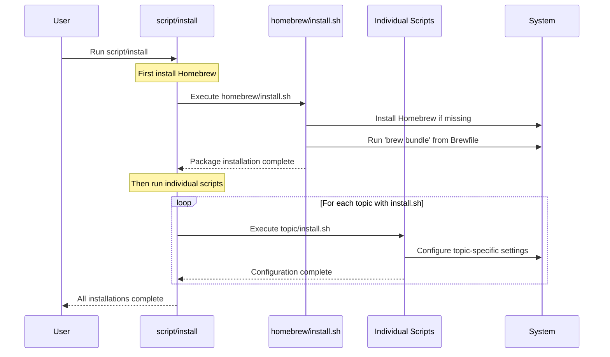
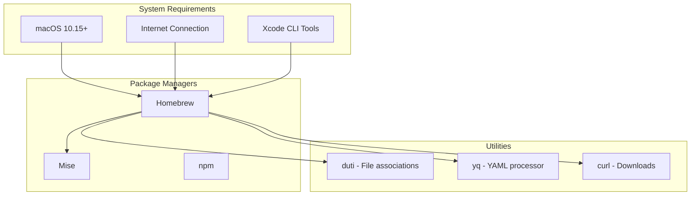

# 📦 Installation Scripts Reference

This document provides a comprehensive guide to all installation scripts in the dotfiles system, their purposes, dependencies, and how they work together.

## Table of Contents

- [Overview](#overview)
- [Script Execution Flow](#script-execution-flow)
- [Individual Scripts](#individual-scripts)
- [Dependencies](#dependencies)
- [Error Handling](#error-handling)
- [Platform Compatibility](#platform-compatibility)
- [Customization](#customization)

## Overview

The dotfiles system uses modular installation scripts located in topic directories. Each `install.sh` script handles the setup and configuration for its specific domain.

### Script Locations

```
~/.dotfiles/
├── archiver/install.sh      # Set Archiver as default for compressed files
├── claude/install.sh        # Claude AI assistant setup
├── code/install.sh          # VS Code configuration and extensions
├── dockutil/install.sh      # macOS Dock configuration
├── ghostty/install.sh       # Ghostty terminal setup
├── homebrew/install.sh      # Homebrew package manager installation
├── mise/install.sh          # Runtime version management
└── ssh/install.sh           # SSH configuration and key management
```

## Script Execution Flow



## Individual Scripts

### 🍺 Homebrew (`homebrew/install.sh`)

**Purpose**: Installs Homebrew package manager and all defined packages

**What it does**:
1. Checks if Homebrew is already installed
2. Installs Homebrew for macOS or Linux if missing
3. Runs `brew bundle` to install all packages from `Brewfile`

**Dependencies**: 
- Internet connection
- macOS: Xcode Command Line Tools
- Linux: Build essentials

**Key Features**:
```bash
# Cross-platform detection
if test "$(uname)" = "Darwin"; then
    # macOS installation
elif test "$(expr substr $(uname -s) 1 5)" = "Linux"; then
    # Linux installation
fi
```

**Packages Installed**: 60+ development tools including:
- Core tools: git, curl, wget, jq
- Development: node, python, go, rust
- Utilities: docker, kubernetes-cli, terraform
- Applications: VS Code, Arc, TablePlus

---

### 💻 VS Code (`code/install.sh`)

**Purpose**: Configures VS Code with settings, keybindings, and extensions

**What it does**:
1. Creates symlinks for settings and keybindings
2. Sets VS Code as default editor for code files
3. Installs 60+ curated extensions
4. Configures file associations using `duti`

**Dependencies**:
- VS Code installed via Homebrew
- `yq` and `duti` (auto-installed if missing)
- `code` command in PATH

**Key Features**:
```bash
# Set as default editor for all code file types
curl "https://raw.githubusercontent.com/github/linguist/master/lib/linguist/languages.yml" \
  | yq -r "to_entries | (map(.value.extensions) | flatten) - [null] | unique | .[]" \
  | grep -vE '\.html|\.htm' \
  | xargs -L 1 -I "{}" duti -s com.microsoft.VSCode {} all
```

**Extensions Include**:
- **AI/Productivity**: Claude Code, GitHub Copilot
- **Language Support**: Python, TypeScript, Go, Rust
- **Tools**: Docker, Terraform, Kubernetes
- **Utilities**: GitLens, Prettier, ESLint

---

### 🔧 Mise (`mise/install.sh`)

**Purpose**: Installs runtime versions and configures development tools

**What it does**:
1. Installs all runtimes defined in `mise.toml`
2. Enables idiomatic version file support
3. Sets up runtime environments

**Dependencies**:
- Mise installed via Homebrew
- Internet connection for downloading runtimes

**Managed Runtimes**:
- **Node.js**: Latest LTS
- **Python**: 3.11, 3.12
- **Go**: Latest stable
- **Rust**: Latest stable
- **Terraform**: Multiple versions
- **Elixir/Erlang**: Latest versions

**Configuration**:
```toml
# ~/.mise.toml (symlinked from mise/mise.toml.symlink)
[tools]
node = "lts"
python = ["3.11", "3.12"]
go = "latest"
rust = "latest"
terraform = ["1.6", "1.7"]
```

---

### 🔐 SSH (`ssh/install.sh`)

**Purpose**: Sets up SSH configuration and generates keys

**What it does**:
1. Creates SSH directory with correct permissions (700)
2. Symlinks SSH configuration files
3. Generates SSH keys if they don't exist
4. Sets proper file permissions

**Security Features**:
```bash
# Secure permissions
chmod 700 ~/.ssh
chmod 600 ~/.ssh/config
chmod 600 ~/.ssh/id_*
chmod 644 ~/.ssh/id_*.pub
```

**Key Generation**:
- **Ed25519**: Primary key for modern systems
- **RSA 4096**: Fallback for older systems
- **ECDSA**: Additional compatibility

**Configuration**:
- Main config: `ssh/config` (public settings)
- Private config: `ssh/config_local` (gitignored)

---

### 🤖 Claude (`claude/install.sh`)

**Purpose**: Sets up Claude AI assistant with agents and commands

**What it does**:
1. Installs Claude CLI if not present
2. Creates symlinks for agents and commands
3. Configures MCP (Model Context Protocol) integrations
4. Sets up API integrations

**MCP Integrations**:
```bash
# Context7 - Documentation lookup
claude mcp add -s user context7 -- npx -y @upstash/context7-mcp@latest

# Playwright - Browser automation  
claude mcp add -s user playwright -- npx -y @playwright/mcp@latest

# Magic - UI component generation
claude mcp add -s user -e API_KEY="$MAGIC_MCP_API_KEY" magic -- npx -y @21st-dev/magic@latest
```

**Features**:
- 40+ specialized AI agents
- Custom commands for development workflows
- Integration with documentation and UI tools

---

### 🏗️ Ghostty (`ghostty/install.sh`)

**Purpose**: Configures Ghostty terminal as default terminal

**What it does**:
1. Sets Ghostty as default for shell files (.sh, .command, .terminal)
2. Creates configuration symlinks
3. Sets up terminal preferences

**File Associations**:
```bash
GHOSTTY_BUNDLE="com.mitchellh.ghostty"
EXTENSIONS=".sh .command .terminal"

for ext in $EXTENSIONS; do
  duti -s $GHOSTTY_BUNDLE $ext all
done
```

---

### 🗃️ Archiver (`archiver/install.sh`)

**Purpose**: Sets Archiver as default app for compressed files

**What it does**:
1. Configures file associations for archive formats
2. Sets Archiver as default handler

**Supported Formats**:
```bash
EXTENSIONS=".zip .rar .7z .tar .gz .bz2 .xz .tgz .tbz2"
```

---

### 🖥️ Dockutil (`dockutil/install.sh`)

**Purpose**: Configures macOS Dock with essential applications

**What it does**:
1. Clears all existing Dock items
2. Adds curated set of development applications
3. Adds useful folders (Downloads, Code)
4. Restarts Dock to apply changes

**Applications Added**:
- **Browsers**: Arc
- **Development**: VS Code, TablePlus, Lens, Apidog
- **Terminal**: Ghostty
- **Containers**: OrbStack
- **AI**: Claude
- **Design**: Figma
- **Productivity**: Notion, Spark
- **Media**: Spotify
- **System**: System Settings

## Dependencies

### System Dependencies



### Installation Order

The scripts have implicit dependencies and should run in this order:

1. **homebrew/install.sh** - Must run first to install package manager
2. **code/install.sh** - Requires `yq` and `duti` from Homebrew
3. **claude/install.sh** - Requires `curl` for Claude installation
4. **All others** - Can run in any order

## Error Handling

### Common Error Patterns

```bash
# Platform detection
if [ "$(uname -s)" != "Darwin" ]; then
  exit 0  # Gracefully skip on non-macOS
fi

# Command availability check
if ! command -v tool &> /dev/null; then
    echo "⚠️  tool not found, installing..."
    brew install tool
fi

# Permission handling
if [ ! -d "$SSH_DIR" ]; then
    mkdir -p "$SSH_DIR"
    chmod 700 "$SSH_DIR"
fi
```

### Error Recovery

1. **Idempotent Design**: Scripts can be run multiple times safely
2. **Dependency Installation**: Auto-install missing dependencies
3. **Graceful Degradation**: Skip optional features if they fail
4. **User Feedback**: Clear error messages with solutions

## Platform Compatibility

### macOS Specific Features

Most scripts include macOS detection:

```bash
# Only run on macOS
if [ "$(uname -s)" != "Darwin" ]; then
  exit 0
fi
```

**macOS-only features**:
- File associations (`duti`)
- Dock configuration (`dockutil`)
- Application directory paths
- Bundle identifiers

### Cross-Platform Elements

Some scripts work across platforms:
- **Homebrew**: Supports macOS and Linux
- **Mise**: Cross-platform runtime management
- **SSH**: Universal configuration

## Customization

### Adding Custom Install Scripts

1. **Create the script**:
   ```bash
   mkdir ~/.dotfiles/mytopic
   cat > ~/.dotfiles/mytopic/install.sh << 'EOF'
   #!/bin/sh
   echo "Installing mytopic..."
   
   # Add your installation logic
   if [ "$(uname -s)" = "Darwin" ]; then
     brew install mytool
   fi
   
   # Create configurations
   echo "config" > ~/.mytopicrc
   EOF
   chmod +x ~/.dotfiles/mytopic/install.sh
   ```

2. **Test the script**:
   ```bash
   ~/.dotfiles/mytopic/install.sh
   ```

3. **Run full installation**:
   ```bash
   script/install
   ```

### Customizing Existing Scripts

1. **Fork and modify**: Edit scripts directly for personal changes
2. **Environment variables**: Use env vars for configuration
3. **Local overrides**: Create local versions that extend base scripts

### Script Templates

```bash
#!/bin/sh

# Topic: [TOPIC_NAME]
# Purpose: [DESCRIPTION]

# Only run on macOS (if applicable)
if [ "$(uname -s)" != "Darwin" ]; then
  exit 0
fi

echo "› setting up [TOPIC_NAME]"

# Check dependencies
if ! command -v required_tool &> /dev/null; then
    echo "⚠️  required_tool not found, installing..."
    brew install required_tool
fi

# Main installation logic
echo "Installing [TOPIC_NAME] components..."

# Configuration
echo "Configuring [TOPIC_NAME]..."

# Verification
if command -v new_tool &> /dev/null; then
    echo "✓ [TOPIC_NAME] installation complete"
else
    echo "❌ [TOPIC_NAME] installation failed"
    exit 1
fi
```

---

*All installation scripts are designed to be idempotent, safe to run multiple times, and provide clear feedback during execution.*